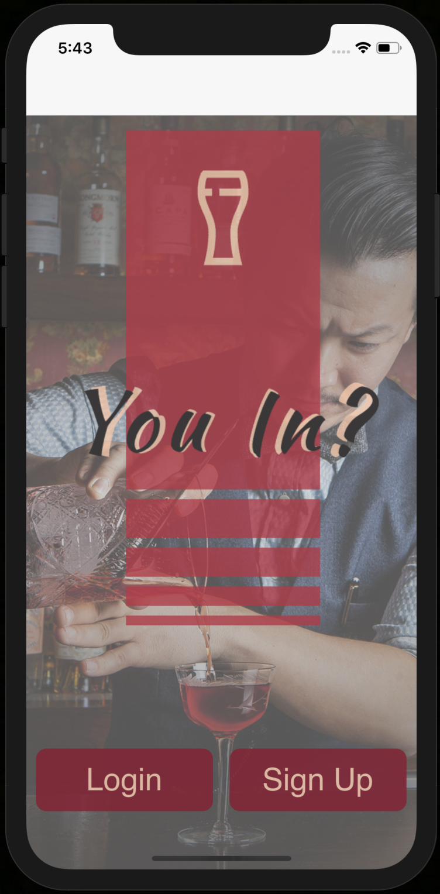
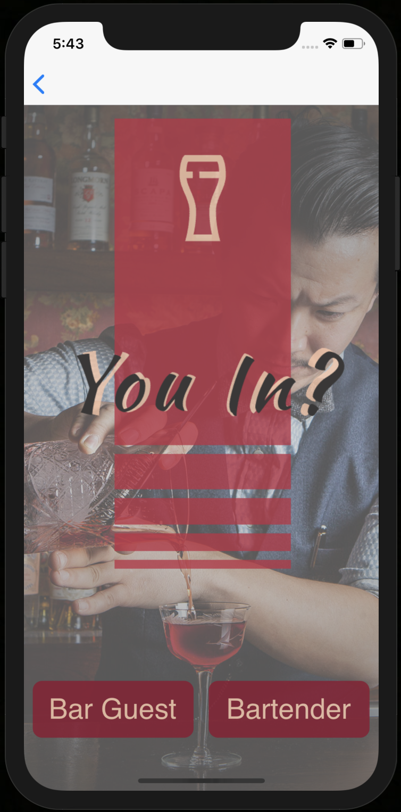
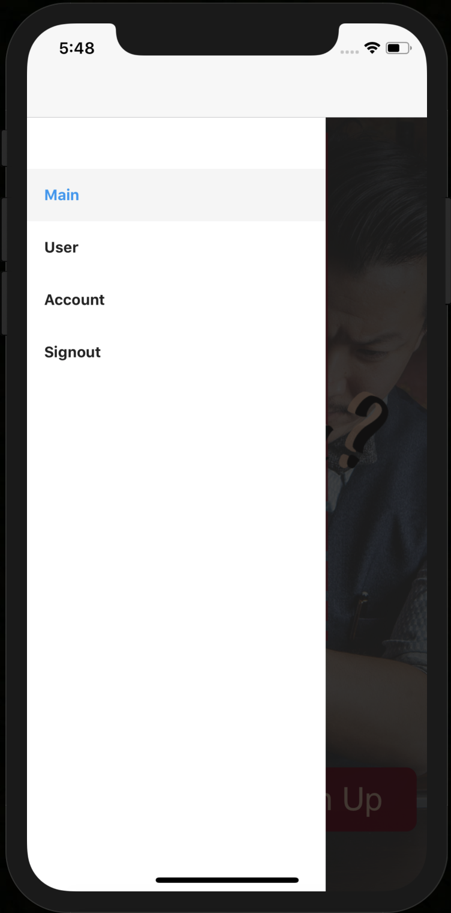
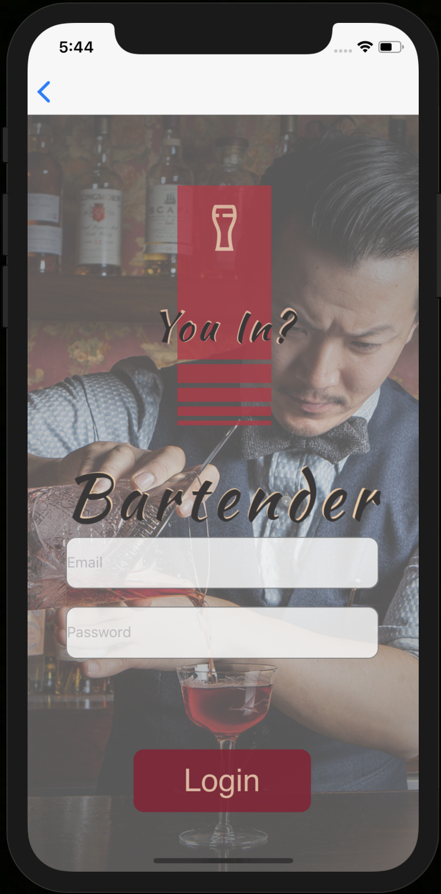
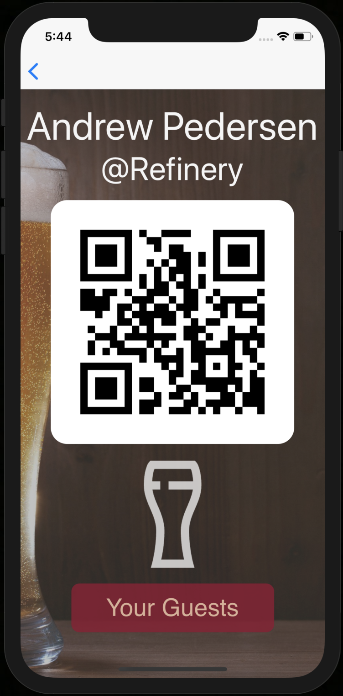
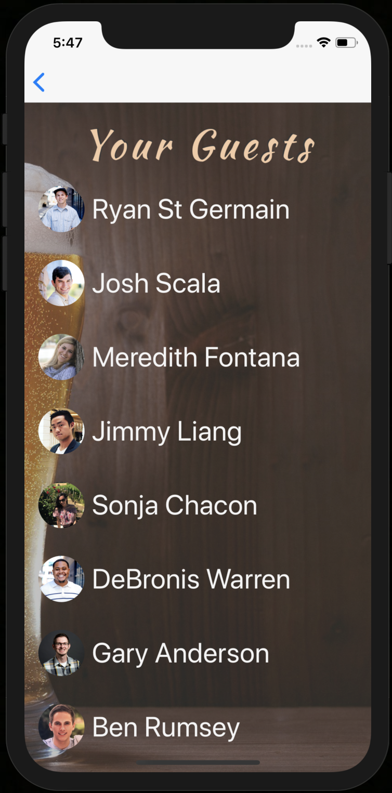
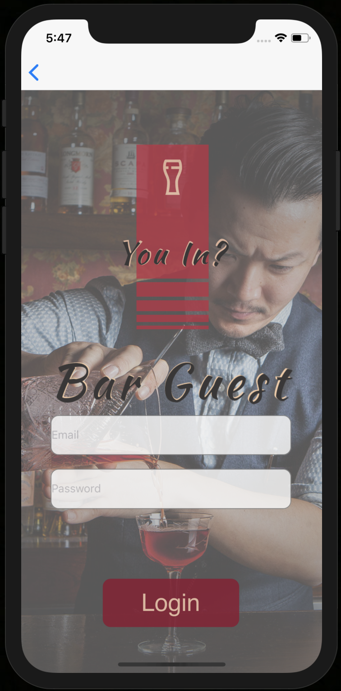
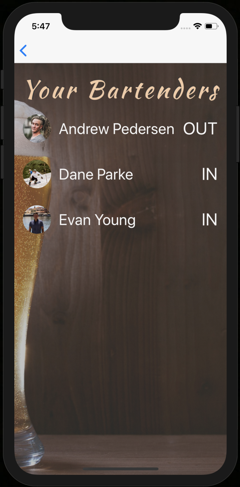

# You In? - Capstone Project 

## Description: 
A native app that uses geolocation to keep track of bartender attendance in order to optimize service received by the guest as well as capital gained by the bartender.

## Project Images: 

### Landing Screen

### Sign In

### Drawer

### Bartender Sign In

### Bartender User Page

### Bartender's Subscribed Guests

### Guest Sign In

### Guest's Preferred Bartenders

### Technologies Used:
- Vue Native 
- Expo 
- HTML5
- CSS3
- Flexbox 
- Node.js
- Express
- PostgreSQL
- Knex.js

### Repo Links:
- Front-End Repo: https://github.com/reidgarner/You-In-Frontend
- Back-End Repo: https://github.com/reidgarner/You-In-Backend

### Installation and Run:
- $ npm install
- $ npm run ios